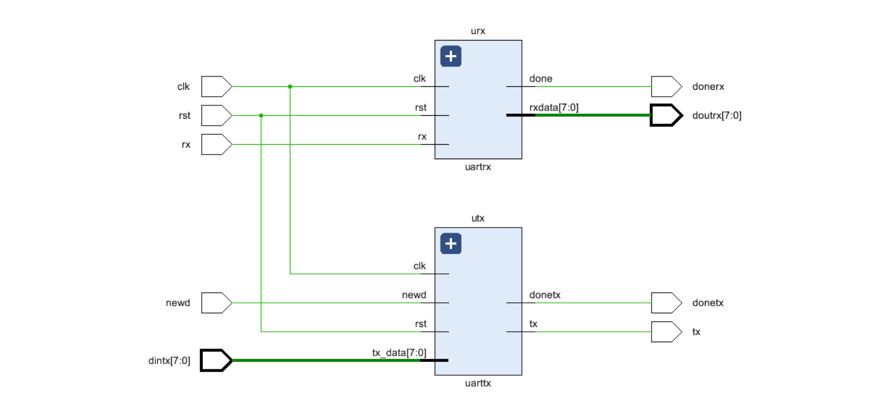
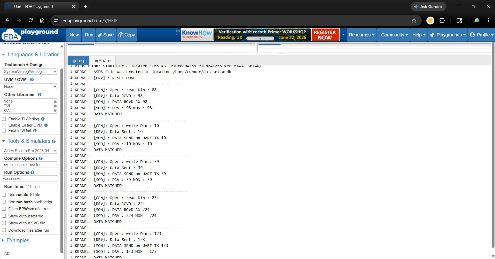

# 📡 UART Verification using SystemVerilog

## 📌 About UART
UART (Universal Asynchronous Receiver Transmitter) is a serial communication protocol used for data transfer between devices without a shared clock.  
It operates using start and stop bits, making it simple and widely used in embedded systems, microcontrollers, and communication interfaces.

---

## 🧪 Project Overview
This project implements a **SystemVerilog-based verification environment** to validate UART functionality.  
It uses a modular architecture with Generator, Driver, Monitor, and Scoreboard to ensure correct data transmission and reception.

---

## 🖼️ Design Schematic

---

## 📊 Simulation Output

---
